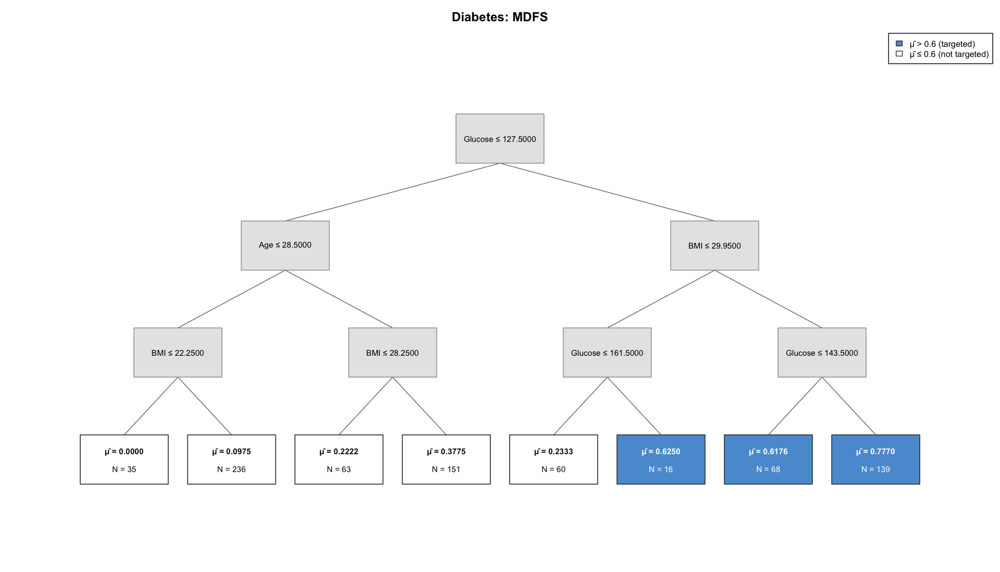
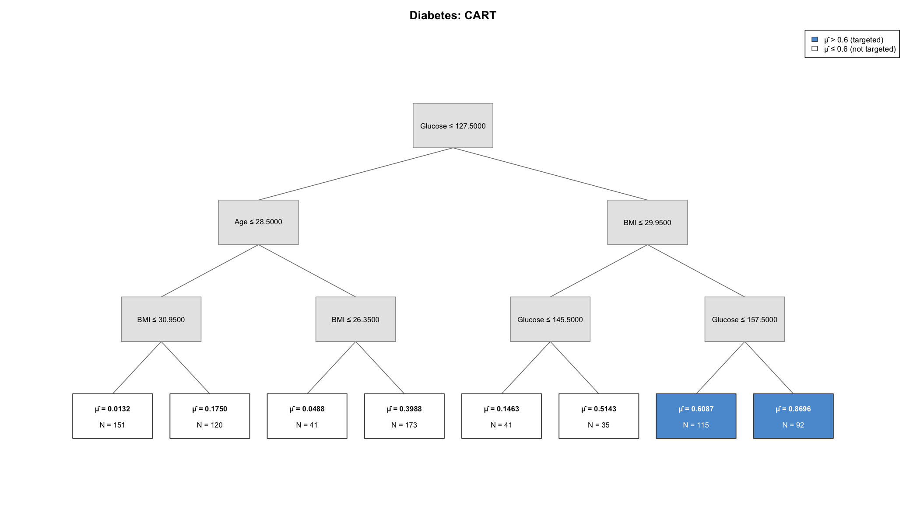
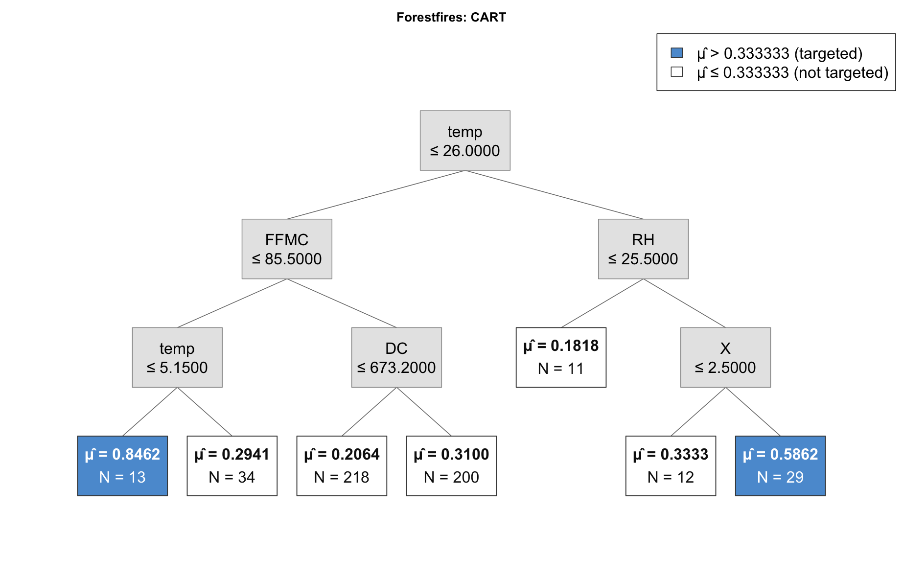
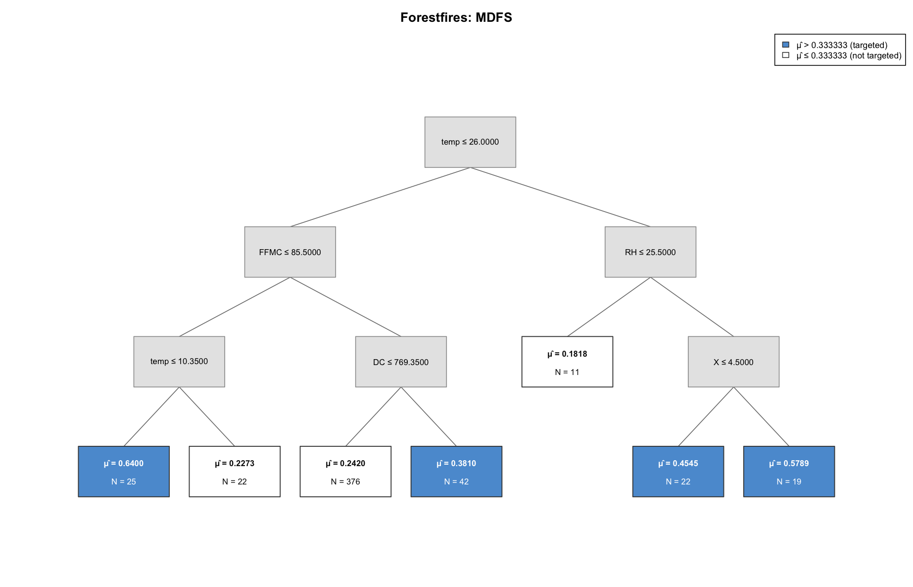
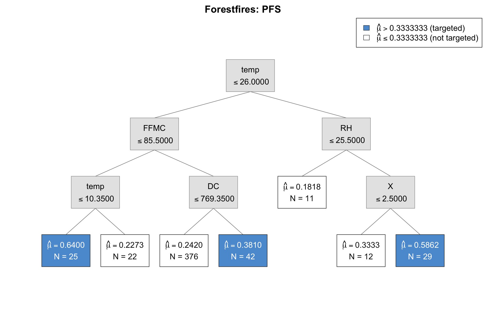

# targetree for R

`targetree` helps applied researchers construct interpretable targeting rules
for binary outcomes. It fits classification trees using CART, Penalized Final
Split (PFS), or Maximum Distance Final Split (MDFS), evaluates the resulting
targeting policy, and draws tree diagrams for papers and presentations. This
is a native R package and does not require Python.

## Installation

Install the package directly from GitHub:

```r
install.packages("remotes")  # Run this once if remotes is not installed
remotes::install_github("Bill-Wang-Metrics/targetree-r")
```

Then load the package and open its documentation:

```r
library(targetree)
help(package = "targetree")
?targetree
```

To update the package later, run:

```r
remotes::install_github("Bill-Wang-Metrics/targetree-r", force = TRUE)
```

## What targetree produces

`targetree` turns a fitted classification tree into an interpretable targeting
policy. Internal nodes display the splitting rules. Terminal nodes report the
estimated outcome probability, $\hat{\mu}$, and subgroup size, $N$. Blue terminal
nodes are targeted because their estimated probabilities exceed the selected
policy threshold; white terminal nodes are not targeted.



## Quick start

The package includes the 768-observation diabetes dataset. The following
example fits an MDFS tree and targets terminal groups whose estimated outcome
probability exceeds 0.60:

```r
library(targetree)
data("diabetes", package = "targetree")

predictors <- setdiff(names(diabetes), "Outcome")
X <- diabetes[predictors]
y <- diabetes$Outcome

model <- targetree(
  depth = 3,
  minimum_portion = 0.02,
  method = "mdfs",
  cut = 0.60,
  feature_name = predictors
)

model$fit(X, y)
diabetes_risk <- model$predict(X)
targeted <- diabetes_risk > model$cut

model$get_risk(X, y)
model$print_tree()
model$plot(
  title = "MDFS tree",
  split_rule_lines = 2,
  save_path = "diabetes-mdfs.pdf"
)
```

`model$predict()` returns the terminal-node probability assigned to every
observation. `model$get_risk()` reports the true-positive, false-negative,
false-positive, and true-negative counts. The logical vector `targeted`
indicates which observations belong to terminal groups above `cut`.
`minimum_portion = 0.02` requires each terminal group to contain at least
`ceiling(0.02 * nrow(X))` observations from the estimation sample.

## Methods

Use the same `targetree()` constructor for all three algorithms and select the
algorithm with the `method` argument:

| `method` | Default `lbd` | Description |
|---|---:|---|
| `"cart"` | 0 | Standard CART splitting; the targeting threshold is applied after fitting |
| `"pfs"` | 0 | A threshold-focused final split with a researcher-selected weight, `lbd` |
| `"mdfs"` | 1 | A fully threshold-focused final split |

For PFS, set `lbd` between 0 and 1. The examples below use `lbd = 0.5`.
The older `CART$new()` constructor remains available so that existing scripts
continue to run, but `targetree()` is the recommended interface.

## Worked examples

### Diabetes

This example uses `Outcome` as the binary response and the other eight
variables as predictors. It fits CART, MDFS, and PFS using the same depth,
minimum-portion setting, and targeting threshold.

```r
library(targetree)
data("diabetes", package = "targetree")

predictors <- setdiff(names(diabetes), "Outcome")
X <- diabetes[predictors]
y <- diabetes$Outcome

diabetes_cart <- targetree(
  depth = 3, minimum_portion = 0.02,
  method = "cart", cut = 0.60,
  feature_name = predictors
)
diabetes_cart$fit(X, y)
diabetes_cart$get_risk(X, y)
diabetes_cart$plot(
  title = "CART", split_rule_lines = 2,
  save_path = "diabetes-cart.pdf"
)

diabetes_mdfs <- targetree(
  depth = 3, minimum_portion = 0.02,
  method = "mdfs", cut = 0.60,
  feature_name = predictors
)
diabetes_mdfs$fit(X, y)
diabetes_mdfs$get_risk(X, y)
diabetes_mdfs$plot(
  title = "MDFS", split_rule_lines = 2,
  save_path = "diabetes-mdfs.pdf"
)

diabetes_pfs <- targetree(
  depth = 3, minimum_portion = 0.02,
  method = "pfs", lbd = 0.5, cut = 0.60,
  feature_name = predictors
)
diabetes_pfs$fit(X, y)
diabetes_pfs$get_risk(X, y)
diabetes_pfs$plot(
  title = "PFS (lambda = 0.5)", split_rule_lines = 2,
  save_path = "diabetes-pfs.pdf"
)
```

Diabetes CART tree:



Diabetes MDFS tree:


Diabetes PFS tree (`lbd = 0.5`):


### Forest fires

The package also includes the 517-observation forest-fire dataset. Following
the Python and Stata examples, the binary outcome equals one when the burned
area exceeds five hectares. The predictors exclude the original `month`,
`day`, and `area` columns.

```r
library(targetree)
data("forestfires", package = "targetree")

y <- as.integer(forestfires$area > 5)
predictors <- c("X", "Y", "FFMC", "DMC", "DC", "ISI",
                "temp", "RH", "wind", "rain")
X <- forestfires[predictors]
cut <- 1 / 3

forestfires_cart <- targetree(
  depth = 3, minimum_portion = 0.02,
  method = "cart", cut = cut,
  feature_name = predictors
)
forestfires_cart$fit(X, y)
forestfires_cart$get_risk(X, y)
forestfires_cart$plot(
  title = "CART", split_rule_lines = 2,
  save_path = "forestfires-cart.pdf"
)

forestfires_mdfs <- targetree(
  depth = 3, minimum_portion = 0.02,
  method = "mdfs", cut = cut,
  feature_name = predictors
)
forestfires_mdfs$fit(X, y)
forestfires_mdfs$get_risk(X, y)
forestfires_mdfs$plot(
  title = "MDFS", split_rule_lines = 2,
  save_path = "forestfires-mdfs.pdf"
)

forestfires_pfs <- targetree(
  depth = 3, minimum_portion = 0.02,
  method = "pfs", lbd = 0.5, cut = cut,
  feature_name = predictors
)
forestfires_pfs$fit(X, y)
forestfires_pfs$get_risk(X, y)
forestfires_pfs$plot(
  title = "PFS (lambda = 0.5)", split_rule_lines = 2,
  save_path = "forestfires-pfs.pdf"
)
```

Forest-fire CART tree:



Forest-fire MDFS tree:



Forest-fire PFS tree (`lbd = 0.5`):



The confusion-matrix counts reproduce the Python and Stata reference
implementations:

| Dataset | Method | TP | FN | FP | TN |
|---|---|---:|---:|---:|---:|
| Diabetes | CART | 150 | 118 | 57 | 443 |
| Diabetes | MDFS | 160 | 108 | 63 | 437 |
| Diabetes | PFS (`lbd = 0.5`) | 160 | 108 | 63 | 437 |
| Forest fires | CART | 28 | 123 | 14 | 352 |
| Forest fires | MDFS | 53 | 98 | 55 | 311 |
| Forest fires | PFS (`lbd = 0.5`) | 49 | 102 | 47 | 319 |

## Categorical predictors

Supply a data frame and identify categorical predictors by column name or by
R's one-based column position. For example, the included forest-fire data also
contain `month` and `day`:

```r
data("forestfires", package = "targetree")

y <- as.integer(forestfires$area > 5)
predictors <- setdiff(names(forestfires), "area")
X <- forestfires[predictors]

categorical_model <- targetree(
  depth = 3,
  minimum_portion = 0.02,
  method = "mdfs",
  cut = 1 / 3,
  categorical_features = c("month", "day")
)
categorical_model$fit(X, y)
```

## Tree output

```r
model$print_tree()
model$plot(title = "MDFS tree", split_rule_lines = 2)
model$plot(
  title = "MDFS tree", save_path = "tree.pdf",
  font_size = 15, split_rule_lines = 2, title_font_size = 18
)
```

PNG, PDF, and SVG output are supported. When `save_path` is omitted, the tree
is drawn on the current R graphics device. By default, `font_size = NULL`
selects the largest uniform font that fits every node box. Supply a positive
font size in points, such as `font_size = 15`, to override the automatic size.
Use `split_rule_lines = 1` for a one-line rule such as `Glucose ≤ 127.5`, or
`split_rule_lines = 2` to place `Glucose` and `≤ 127.5` on separate lines.
Two-line rules generally allow the automatic font size to be larger. The title
is slightly larger than the node text by default; set `title_font_size` to a
positive point size, such as `title_font_size = 18`, to control it directly.
Terminal-node means and legend labels use mathematical typesetting for
`hat(mu)`, so the accent is centered over the Greek letter. Numeric split rules
also use mathematical typesetting, ensuring that `<=` renders as a true `≤` in
PNG, PDF, and SVG output without font-encoding warnings.

## Getting help

Use `?targetree` and `?plot_cart_tree` for the complete function documentation.
Questions and bug reports can be submitted through the repository's
[Issues page](https://github.com/Bill-Wang-Metrics/targetree-r/issues).
